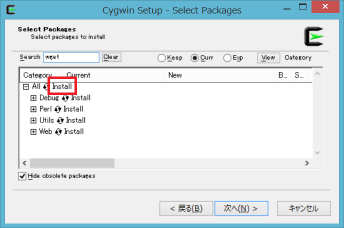

# #01 Cygwinの導入編
_ _ _

どの言語をやるにあたっても必要になるソフトの導入をしてしまおうと思います。  
正直、この作業が一番大変かもしれません。(時間かかるし)  
ここで心が折れてしまいそうですが、頑張りましょう！

#####今回導入するもの
* __Cygwin__

いわゆるターミナルを使うために導入します。  
Windowsに最初から入っている「コマンドプロンプト」だと色々と不便なことがあったり、  
出来ないことがあったりするので、別途コマンドラインをインストールします。  
最初に入れるソフトにして、一番扱いが難しいソフトウェアだと思います。  
しかし、ちゃんと使いこなせればとても便利です。

では、導入してみましょう。

####1.インストール

1. まず、[Cygwin公式サイト](https://www.cygwin.com/)にアクセスします。  
2. 左側のメニューから「Install Cygwin」をクリックします。  
3. ここで使用PCが  
 - 32bitの場合は32bit versionsの「setup-x86.exe」
 - 64bitの場合は64bit versionsの「setup-x86_64.exe」

 をクリックし、ダウンロードします。(このファイルは要保管)

これで、とりあえず準備は出来ました。ここからCygwinをインストールします。  
1. DLしたファイルを実行したら、とりあえず「次へ」を選択します。　　
2. 「Install from Internet」を選択して「次へ」。  
3. 特に困ることがない限りは「C:\cygwin64」入れてしまいましょう。というわけで、「次へ」。  
4. これも特に問題なければそのまま「次へ」。  
5. 個人的に「Direct Connection」がいいと思うので、選択して「次へ」。  
6. 日本のサーバのほうが安定すると思うので末尾が「ac.jp」で終わってるアドレスを選択して「次へ」。  
7. 左上の「search」と書いてあるボックスに必要なパッケージを入力します。  

さて、ここで今回入れるパッケージですが、とりあえず次のものを入れておきます。
- wget(必須)
- gcc(C言語プログラミングに必須)

他に追加したいものがあれば、いつでもここからパッケージを入れることができます。

では、これらを左上のsearchに入力してみましょう。  
そして画像の赤い枠のところを「Install」と表示されるまでクリックしましょう。

他のパッケージも同様にして「Install」にしたら、「次へ」を押します。  
すると、ここからインストールが開始します。  
初回は長いとは思いますが、辛抱して待ちましょう。

インストールが終わると、
- デスクトップにアイコンを作るか
- スタートメニューにCygwinを登録するか

の選択肢が出ます。これはお好みでどうぞ。
_ _ _

####2.設定(.minttyrc)

ここからが本当の闇だ。

というのは冗談ですが、ここからは結構面倒くさいかもしれません。  
ここで書くのはあくまで一例なので、必要に応じてググるのもいいと思います。  

ここで重要な事なのですが…  
__この先は「サクラエディタ」をインストールしていることを推奨します。__  
サクラエディタ公式サイトは[__こちら__](http://sakura-editor.sourceforge.net/)  
そうでもしないと設定ファイルを書き換える手段が難しくなります…。

1. Cygwinをインストールしたフォルダに移動します。  
（何もいじっていなければ"C:\cygwin64"のはず）  
2. そこから、Home -> (ユーザ名の書かれたフォルダ)と開いていきます。  
3. .minttyrcというファイルを開く、または作成します。  

この.minttyrcとは、Cygwinの見た目を変更するものです。  
変えない場合はこのままでどうぞ。  

_（注）.minttyrcというのは拡張子のように見えますが、こういうファイル名です。  
なので「.」以前に何か文字を入れると機能しなくなりますのでご注意を。_  

例えば私の場合、このファイルにはこう書かれています。（括弧内は書いてませんが補足説明です）

    Locale=ja_JP  
    Charset=SJIS  (文字コード、こうしないと日本語表示されない)
    Font=Mgen+ 2m regular (フォントの設定)
    FontHeight=11　(フォントサイズ)
    FontIsBold=no　(フォントを太字にするかどうか)
    BackgroundColour=0,0,0　(背景色、ここでは黒)
    ForegroundColour=255,255,255　(文字色、ここでは白)
    CursorColour=255,255,255　(カーソルの色、ここでは白)
    OpaqueWhenFocused=no　(よくわからない)
    Transparency=40　(Cygwinをどれだけ透過するか)
_ _ _

####3.設定(.bashrc)

執筆中.
